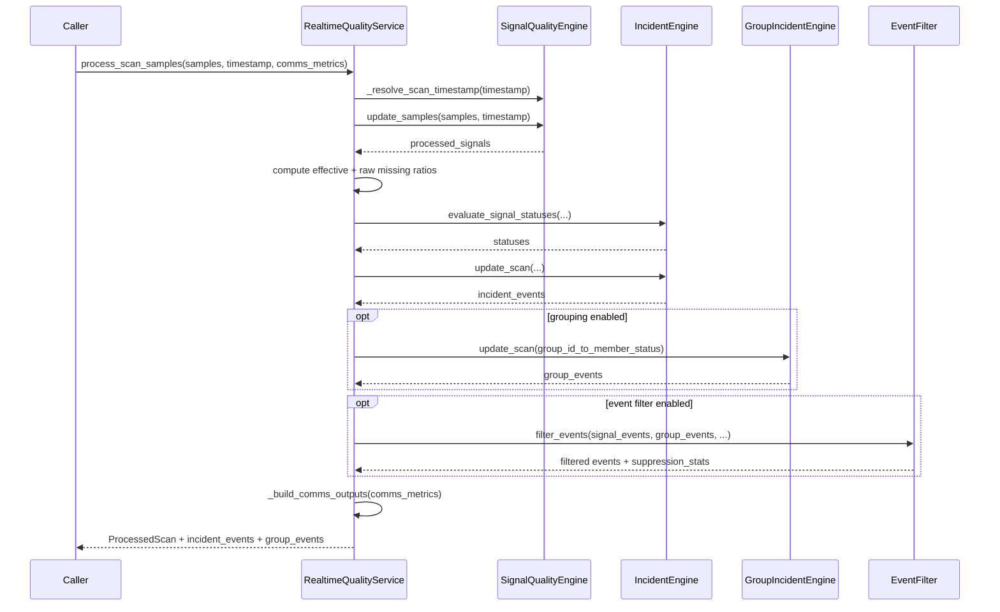

# Per-scan dataflow

This document describes the exact per-scan execution path and state touch points for Codex-01 scope.

## 1) Scan contract

### Inputs

`RealtimeQualityService` supports two scan input contracts in `sqe/ops/service.py`:

- `process_scan(signals: Dict[str, Optional[float]], timestamp: Optional[float] = None, comms_health_by_signal: Optional[Dict[str, Dict[str, Any]]] = None, comms_metrics: Optional[List[CommsMetrics]] = None)`
- `process_scan_samples(samples: Dict[str, Sample], timestamp: Optional[float] = None, comms_health_by_signal: Optional[Dict[str, Dict[str, Any]]] = None, comms_metrics: Optional[List[CommsMetrics]] = None)`

Both paths accept an optional `timestamp`; if absent, service resolves it via `SignalQualityEngine._resolve_scan_timestamp`.

### Outputs

Both methods return:

- `ProcessedScan(processed_signals, suppression_stats, comms_health, comms_utilization_statuses)`
- `List[IncidentEvent]`
- `List[GroupIncidentEvent]`

`ProcessedScan` carries:

- `processed_signals: Dict[str, ProcessedSignal]`
- `suppression_stats: Optional[Dict[str, int]]`
- `comms_health: Optional[List[CommsHealthStatus]]`
- `comms_utilization_statuses: Optional[List[UtilizationStatus]]`

## 2) Sequence per scan (service layer)

The service-level ordering in both `process_scan` and `process_scan_samples` is:

1. Resolve scan timestamp: `engine._resolve_scan_timestamp(timestamp)`.
2. Run engine update:
   - `engine.update(signals, timestamp=timestamp)`, or
   - `engine.update_samples(samples, timestamp=timestamp)`.
3. Compute missingness ratios from processor state:
   - effective: `processor.get_effective_missing_ratio()`
   - raw: `processor.missing_buffer.get_missing_ratio()`
4. Evaluate signal statuses:
   - `IncidentEngine.evaluate_signal_statuses(...)`
5. Update incident lifecycle:
   - `IncidentEngine.update_scan(...)`
6. Optionally update group incidents (if `group_resolver` and `group_incident_engine` exist):
   - build `group_id_to_member_status`
   - `group_incident_engine.update_scan(...)`
7. Optionally filter events (if `event_filter` and `event_filter_policy` exist):
   - `event_filter.filter_events(...)`
   - capture `suppression_stats` when emitted
8. Increment service scan counter: `self.scan_index += 1`.
9. Optionally build comms outputs from `_build_comms_outputs(comms_metrics)`.
10. Return `ProcessedScan` + incidents + group incidents.

### Sequence diagram (`process_scan_samples`)

## 3) Per-signal pipeline (processor)

`SignalProcessor.update` in `sqe/core/engine.py` executes the following per-sample order:

1. Increment sample counter and map `SampleQuality.BAD` to missing (`x = None`).
2. Compute quality penalty (`0.0`, `0.5`, `1.0`) and append to `quality_penalties`.
3. Push value into missing buffer: `missing_buffer.push(x)`.
4. Early return on missing:
   - if `x is None`: increment `missing_count` and return `None`.
5. Apply filters in order:
   - `EWMAFilter.update`
   - `MovingAverageFilter.update`
   - `HighPassFilter.update`
6. Drift update:
   - `DriftDetector.update`
7. Spike and variance order:
   - `SpikeDetector.update` first (pre-update baseline stats)
   - `VarianceCalculator.update` second
8. Oscillation update (conditional):
   - if enabled: `OscillationDetector.update(load_shed, cadence, skip_fft)`
   - else use zeroed/default frequency payload
9. Stale detection (conditional):
   - if enabled: `StaleDetector.update`
10. Step detection (conditional):
   - if enabled: `StepChangeDetector.update`
11. Plausibility checks (conditional):
   - if enabled: `PlausibilityChecker.update`
12. SQI calculation:
   - compute `missing_ratio = get_effective_missing_ratio()`
   - compute stale/step/plausibility component scores (0 or 100)
   - call `SignalQualityIndex.calculate(...)`
13. Alert thresholds after SQI:
   - `alert_level` from `sqi_critical_threshold` and `sqi_warning_threshold`
   - `drift_alert` from `drift_alert_threshold`
   - `spike_alert` from `spike_alert_threshold`
14. Return fully populated `ProcessedSignal`.

### Component enablement gates

`SignalConfig.enabled_components(required_causes)` controls which optional components are active at construction time (e.g., oscillation, stale, step, plausibility), and raises if a required incident cause is disabled by threshold settings.

## 4) Incident lifecycle and cause selection touchpoints

Per scan, incidents are updated through:

- `IncidentEngine.evaluate_signal_statuses(...)`
- `IncidentEngine.update_scan(...)`

Cause/severity internals are selected with:

- `_select_cause(...)`
- `_is_cause_eligible(...)`
- `_build_details(...)`

`required_causes_from_policy(policy)` defines hard-required SQI components that feed engine construction via `required_incident_causes`.

## 5) Determinism and bounded compute notes

### Determinism notes

Deterministic per-scan behavior is tied to:

- registration-order processing list: `SignalQualityEngine._registration_order`, consumed by `SignalQualityEngine.update` and `SignalQualityEngine.update_samples`
- sorted unknown-id registration path: `for signal_id in sorted(unknown_ids)`
- replay output sorting:
  - processed rows iterate `for signal_id in sorted(processed)` in `_build_processed_rows`
  - incidents/groups sorted with `_incident_sort_key` and `_group_incident_sort_key` in `run_replay`

### Bounded compute notes

The engine contains explicit load-shed controls in hot path calls (`load_shed`, `oscillation_cadence`, `skip_fft`) and computes p95 scan-time behavior in `_update_load_shedding`.

The allocation/throughput guardrail for this area is captured by performance fence tests, especially `sqe/tests/test_perf_smoke.py::test_hot_path_allocation_free`.
